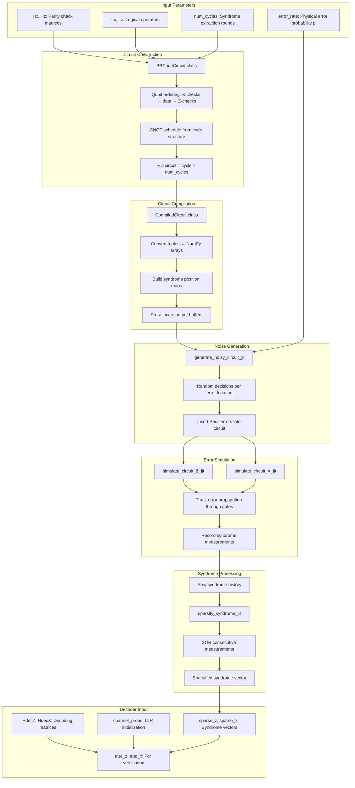

# Noise Model Implementation Documentation

This document provides a comprehensive explanation of the noise model used in the qLDPC Simulation project. It covers the theoretical background, implementation details, and data flow from circuit construction to decoder input.

---

## Table of Contents

1. [Overview](#1-overview)
2. [File Structure](#2-file-structure)
3. [Theoretical Background: Depolarizing Noise](#3-theoretical-background-depolarizing-noise)
4. [Circuit Representation](#4-circuit-representation)
5. [Noise Injection](#5-noise-injection)
6. [Error Propagation Simulation](#6-error-propagation-simulation)
7. [Syndrome Extraction and Sparsification](#7-syndrome-extraction-and-sparsification)
8. [Decoding Matrix Construction](#8-decoding-matrix-construction)
   - [8.0 Code-Capacity vs Circuit-Level: A Critical Comparison](#80-code-capacity-vs-circuit-level-a-critical-comparison)
   - [8.0.1 What Are the Rows? (Spatio-Temporal Syndrome)](#801-what-are-the-rows-spatio-temporal-syndrome)
   - [8.0.2 What Are the Columns? (Fault Equivalence Classes)](#802-what-are-the-columns-fault-equivalence-classes)
   - [8.0.3 Why Do We Merge Faults?](#803-why-do-we-merge-faults)
   - [8.0.4 What Does Decoding Actually Find?](#804-what-does-decoding-actually-find)
   - [8.0.5 Spatial vs Temporal: How Can We Tell?](#805-spatial-vs-temporal-how-can-we-tell)
   - [8.0.6 The Decoding Matrix Structure Visualized](#806-the-decoding-matrix-structure-visualized)
   - [8.0.7 Summary: Code-Capacity vs Circuit-Level](#807-summary-code-capacity-vs-circuit-level)
9. [Complete Data Flow](#9-complete-data-flow)
10. [Example Walkthrough](#10-example-walkthrough)
11. [Glossary](#11-glossary)

---

## 1. Overview

The noise model simulates **circuit-level depolarizing noise** on a quantum error correction circuit. The key idea is:

1. **Build** a syndrome extraction circuit for the qLDPC code
2. **Inject noise** at various locations (gates, preparations, measurements)
3. **Simulate** how Pauli errors propagate through the circuit
4. **Extract syndromes** from measurements
5. **Build decoding matrices** that map error configurations to syndrome patterns

The outputs are fed to a **belief propagation decoder** (Min-Sum) to recover the original logical information.

```
┌──────────────┐     ┌──────────────┐     ┌──────────────┐     ┌──────────────┐
│   Circuit    │────▶│    Noise     │────▶│  Propagation │────▶│   Syndrome   │
│ Construction │     │  Injection   │     │  Simulation  │     │  Extraction  │
└──────────────┘     └──────────────┘     └──────────────┘     └──────────────┘
                                                                       │
                                                                       ▼
                     ┌──────────────┐     ┌──────────────┐     ┌──────────────┐
                     │   Decoder    │◀────│   Decoding   │◀────│ Sparsified   │
                     │  (Min-Sum)   │     │   Matrices   │     │  Syndrome    │
                     └──────────────┘     └──────────────┘     └──────────────┘
```

---

## 2. File Structure

The noise model is organized in `src/noise/`:

```
src/noise/
├── __init__.py       # Module exports
├── constants.py      # Integer op codes for gates and Pauli errors
├── model.py          # Pure Python noise generation (reference implementation)
├── kernels.py        # Numba JIT-compiled simulation kernels
├── compiled.py       # Circuit compilation to NumPy arrays
├── builder.py        # Decoding matrix construction
└── simulation.py     # Main simulation entry points
```

### File Purposes

| File            | Purpose                                                                                                     |
| --------------- | ----------------------------------------------------------------------------------------------------------- |
| `constants.py`  | Defines integer op codes (`OP_CNOT=1`, `OP_X=10`, etc.) for efficient array-based simulation                |
| `model.py`      | Reference implementation of noise injection and channel probability computation                             |
| `kernels.py`    | Core simulation functions: `simulate_circuit_Z_jit`, `simulate_circuit_X_jit`, `generate_noisy_circuit_jit` |
| `compiled.py`   | `CompiledCircuit` class that converts tuple-based circuits to NumPy arrays                                  |
| `builder.py`    | `build_decoding_matrices()` - enumerates all single errors and builds the decoding matrix                   |
| `simulation.py` | `run_trial_fast()` - main entry point that ties everything together                                         |

---

## 3. Theoretical Background: Depolarizing Noise

### 3.1 Single-Qubit Depolarizing Channel

The single-qubit depolarizing channel with error rate $p$ is defined as:

$$\mathcal{E}(\rho) = (1-p)\rho + \frac{p}{3}(X\rho X + Y\rho Y + Z\rho Z)$$

This means:

- With probability $(1-p)$: no error occurs
- With probability $\frac{p}{3}$: an $X$ error occurs
- With probability $\frac{p}{3}$: a $Y$ error occurs
- With probability $\frac{p}{3}$: a $Z$ error occurs

### 3.2 Two-Qubit Depolarizing Channel (After CNOT)

After a CNOT gate, the two-qubit depolarizing channel is:

$$\mathcal{E}(\rho) = (1-p)\rho + \frac{p}{15}\sum_{P \in \mathcal{P}_2 \setminus \{II\}} P\rho P$$

Where $\mathcal{P}_2 = \{I, X, Y, Z\}^{\otimes 2}$ has 16 elements, and we exclude $II$ (identity), leaving **15 possible errors**:

| Error Type | On Control | On Target | Both |
| ---------- | ---------- | --------- | ---- |
| Single X   | X⊗I        | I⊗X       | -    |
| Single Y   | Y⊗I        | I⊗Y       | -    |
| Single Z   | Z⊗I        | I⊗Z       | -    |
| Correlated | XX         | YY        | ZZ   |
| Mixed      | XY         | YX        | XZ   |
| Mixed      | ZX         | YZ        | ZY   |

### 3.3 Measurement and Preparation Errors

- **Measurement errors**: Modeled as a Pauli error immediately **before** measurement
  - `MeasX` (X-basis measurement): Z error before measurement flips the outcome
  - `MeasZ` (Z-basis measurement): X error before measurement flips the outcome

- **Preparation errors**: Modeled as a Pauli error immediately **after** preparation
  - `PrepX` (prepare |+⟩): Z error after preparation gives |-⟩
  - `PrepZ` (prepare |0⟩): X error after preparation gives |1⟩

### 3.4 Why This Matters for Decoding

For decoding, we don't need the full noise model—we only need to know which errors affect which syndrome bits. Since:

- **Z errors** (including the Z component of Y) flip **X-basis measurements**
- **X errors** (including the X component of Y) flip **Z-basis measurements**

We can simulate Z and X error propagation **independently**.

---

## 4. Circuit Representation

### 4.1 Tuple-Based Format (Human-Readable)

Circuits are originally represented as lists of tuples:

```python
circuit = [
    ('PrepX', (0, 0, 'X')),           # Prepare X-check ancilla in |+⟩
    ('PrepZ', (0, 0, 'Z')),           # Prepare Z-check ancilla in |0⟩
    ('CNOT', (0, 0, 'X'), (0, 1, 'D')),  # CNOT from X-check to data qubit
    ('IDLE', (0, 2, 'D')),            # Data qubit idles
    ('MeasX', (0, 0, 'X')),           # Measure X-check in X-basis
    ('MeasZ', (0, 0, 'Z')),           # Measure Z-check in Z-basis
]
```

The qubit identifier tuple `(row, col, type)` specifies:

- `row`, `col`: Position in the code structure
- `type`: `'X'` for X-check ancilla, `'Z'` for Z-check ancilla, `'D'` for data qubit

### 4.2 Integer Op Codes (Machine-Efficient)

For simulation, gates are converted to integer op codes (defined in `constants.py`):

```python
# Gate type op codes
OP_CNOT = 1
OP_PREP_X = 2
OP_PREP_Z = 3
OP_MEAS_X = 4
OP_MEAS_Z = 5
OP_IDLE = 6

# Single-qubit Pauli errors
OP_X = 10
OP_Y = 11
OP_Z = 12

# Two-qubit Pauli errors (first letter = control, second = target)
OP_XX = 20
OP_XY = 21
OP_XZ = 22
OP_YX = 23
OP_YY = 24
OP_YZ = 25
OP_ZX = 26
OP_ZY = 27
OP_ZZ = 28
```

### 4.3 Array-Based Format

The `circuit_to_arrays()` function in `compiled.py` converts circuits to three parallel arrays:

```python
def circuit_to_arrays(circuit, lin_order):
    """
    Returns:
        ops: Array of op codes (int32)
        q1: Array of first qubit indices (int32)
        q2: Array of second qubit indices, -1 for single-qubit gates
    """
```

Example:

```
Circuit: [('CNOT', ctrl, tgt), ('PrepX', q), ('Z', q)]

ops = [1,  2,  12]   # OP_CNOT, OP_PREP_X, OP_Z
q1  = [0,  3,  3 ]   # ctrl_idx, q_idx, q_idx
q2  = [5, -1, -1]    # tgt_idx, N/A, N/A
```

### 4.4 The `CompiledCircuit` Class

The `CompiledCircuit` class (`compiled.py`) pre-computes everything needed for fast simulation:

```python
class CompiledCircuit:
    def __init__(self, base_circuit, noiseless_suffix, lin_order,
                 data_qubits, Xchecks, Zchecks):
        # Convert circuits to arrays
        self.base_ops, self.base_q1, self.base_q2 = circuit_to_arrays(base_circuit, lin_order)
        self.suffix_ops, self.suffix_q1, self.suffix_q2 = circuit_to_arrays(noiseless_suffix, lin_order)

        # Build syndrome position maps (for sparsification)
        self.x_syn_positions, self.x_syn_ptrs = build_syndrome_map_arrays(Xchecks, full_circuit, 'MeasX')
        self.z_syn_positions, self.z_syn_ptrs = build_syndrome_map_arrays(Zchecks, full_circuit, 'MeasZ')

        # Pre-allocate output buffers
        self.out_ops = np.empty(max_circuit_size, dtype=np.int32)
        self.out_q1 = np.empty(max_circuit_size, dtype=np.int32)
        self.out_q2 = np.empty(max_circuit_size, dtype=np.int32)
```

---

## 5. Noise Injection

Noise injection transforms a "clean" circuit into a "noisy" circuit by probabilistically inserting Pauli error operations.

### 5.1 Error Locations and Types

| Gate Type | Error Timing           | Error Type                  | Probability |
| --------- | ---------------------- | --------------------------- | ----------- |
| `MeasX`   | **Before** measurement | Z                           | $p$         |
| `MeasZ`   | **Before** measurement | X                           | $p$         |
| `PrepX`   | **After** preparation  | Z                           | $p$         |
| `PrepZ`   | **After** preparation  | X                           | $p$         |
| `IDLE`    | During idle            | X, Y, or Z (uniform random) | $p$         |
| `CNOT`    | **After** gate         | One of 15 two-qubit Paulis  | $p$         |

### 5.2 Implementation: `generate_noisy_circuit_jit()`

The core noise injection function in `kernels.py`:

```python
@njit(cache=True, nogil=True)
def generate_noisy_circuit_jit(
    base_ops, base_q1, base_q2,    # Input circuit arrays
    error_rate,                     # Probability p
    random_vals,                    # Pre-generated random decisions
    random_paulis,                  # For IDLE: which Pauli (0=X, 1=Y, 2=Z)
    random_two_qubit,               # For CNOT: which of 15 errors (0-14)
    out_ops, out_q1, out_q2         # Output circuit arrays
) -> int:                           # Returns length of output circuit
```

**Key Logic:**

```python
# For MeasX: Z error BEFORE measurement
if op == OP_MEAS_X:
    if random_vals[rand_idx] < error_rate:
        out_ops[out_idx] = OP_Z      # Insert Z error
        out_q1[out_idx] = q1
        out_idx += 1
    rand_idx += 1
    out_ops[out_idx] = op            # Then the measurement
    out_idx += 1

# For PrepX: Z error AFTER preparation
elif op == OP_PREP_X:
    out_ops[out_idx] = op            # First the preparation
    out_idx += 1
    if random_vals[rand_idx] < error_rate:
        out_ops[out_idx] = OP_Z      # Insert Z error
        out_idx += 1
    rand_idx += 1

# For IDLE: random X, Y, or Z
elif op == OP_IDLE:
    if random_vals[rand_idx] < error_rate:
        pauli_choice = random_paulis[rand_idx]  # 0, 1, or 2
        out_ops[out_idx] = [OP_X, OP_Y, OP_Z][pauli_choice]
        out_idx += 1
    rand_idx += 1

# For CNOT: one of 15 two-qubit errors
elif op == OP_CNOT:
    out_ops[out_idx] = op            # First the CNOT
    out_idx += 1
    if random_vals[rand_idx] < error_rate:
        err_type = random_two_qubit[rand_idx]  # 0-14
        # Map to appropriate error op code...
```

### 5.3 The 15 Two-Qubit Pauli Errors

For CNOT gates, when an error occurs, one of 15 equally likely Pauli errors is chosen:

```
Index 0-2:   X, Y, Z on control only
Index 3-5:   X, Y, Z on target only
Index 6-8:   XX, YY, ZZ on both
Index 9-10:  XY, YX on both
Index 11-12: YZ, ZY on both
Index 13-14: XZ, ZX on both
```

---

## 6. Error Propagation Simulation

After generating the noisy circuit, we simulate how errors propagate. **Crucially, Z and X errors are simulated independently** because they affect different syndrome types.

### 6.1 Z-Error Propagation (`simulate_circuit_Z_jit`)

Tracks how **Z errors** propagate and affect **X-check measurements**.

```python
@njit(cache=True, nogil=True)
def simulate_circuit_Z_jit(circuit_ops, circuit_q1, circuit_q2,
                           total_qubits, x_check_indices, x_check_ptrs,
                           max_syndromes):
    state = np.zeros(total_qubits, dtype=np.int8)  # Z-error state per qubit
    syndrome_history = np.zeros(max_syndromes, dtype=np.int8)

    for i in range(len(circuit_ops)):
        op = circuit_ops[i]
        q1, q2 = circuit_q1[i], circuit_q2[i]

        if op == OP_CNOT:
            # Z propagates: target → control (phase kickback)
            state[q1] ^= state[q2]

        elif op == OP_PREP_X:
            # PrepX resets Z error (projects to X eigenstate)
            state[q1] = 0

        elif op == OP_MEAS_X:
            # Z error flips X measurement outcome
            syndrome_history[syn_count] = state[q1]
            syn_count += 1

        elif op == OP_Z or op == OP_Y:
            # Z or Y error (Y = iXZ has Z component)
            state[q1] ^= 1

        # ... handle two-qubit Z errors (ZZ, ZX, etc.)
```

**Key Propagation Rule for Z through CNOT:**

```
         ┌───┐
ctrl ────┤   ├──── ctrl ⊕ (Z from target)
         │ C │
tgt  ─Z──┤ N ├──── tgt
         │ O │
         │ T │
         └───┘

A Z error on the target propagates to the control (XOR).
This is because: CNOT · (I⊗Z) = (Z⊗Z) · CNOT
```

### 6.2 X-Error Propagation (`simulate_circuit_X_jit`)

Tracks how **X errors** propagate and affect **Z-check measurements**.

```python
@njit(cache=True, nogil=True)
def simulate_circuit_X_jit(circuit_ops, circuit_q1, circuit_q2,
                           total_qubits, z_check_indices, z_check_ptrs,
                           max_syndromes):
    state = np.zeros(total_qubits, dtype=np.int8)  # X-error state per qubit

    for i in range(len(circuit_ops)):
        op = circuit_ops[i]
        q1, q2 = circuit_q1[i], circuit_q2[i]

        if op == OP_CNOT:
            # X propagates: control → target
            state[q2] ^= state[q1]

        elif op == OP_PREP_Z:
            # PrepZ resets X error
            state[q1] = 0

        elif op == OP_MEAS_Z:
            # X error flips Z measurement outcome
            syndrome_history[syn_count] = state[q1]
            syn_count += 1

        elif op == OP_X or op == OP_Y:
            # X or Y error (Y has X component)
            state[q1] ^= 1
```

**Key Propagation Rule for X through CNOT:**

```
         ┌───┐
ctrl ─X──┤   ├──── ctrl
         │ C │
tgt  ────┤ N ├──── tgt ⊕ (X from control)
         │ O │
         │ T │
         └───┘

An X error on the control propagates to the target (XOR).
This is because: CNOT · (X⊗I) = (X⊗X) · CNOT
```

### 6.3 Summary of Propagation Rules

| Error Type | Through CNOT     | PrepX Effect | PrepZ Effect | MeasX Effect  | MeasZ Effect  |
| ---------- | ---------------- | ------------ | ------------ | ------------- | ------------- |
| Z error    | target → control | Reset to 0   | No effect    | Flips outcome | No effect     |
| X error    | control → target | No effect    | Reset to 0   | No effect     | Flips outcome |

---

## 7. Syndrome Extraction and Sparsification

### 7.1 Raw Syndrome History

During simulation, each `MeasX` or `MeasZ` records a syndrome bit:

```python
# In simulate_circuit_Z_jit:
if op == OP_MEAS_X:
    syndrome_history[syn_count] = state[q1]  # 0 or 1
    syn_count += 1
```

For a circuit with `num_cycles` syndrome extraction rounds and `m` checks, we get `m × num_cycles` syndrome bits.

### 7.2 Sparsification (Differential Syndrome)

Raw syndromes are not ideal for decoding because:

- A single error might flip **all subsequent measurements** of a check
- We want to detect **when** an error occurred, not just that it occurred

**Sparsification** computes the XOR of consecutive measurements for each check:

$$\text{sparse}[t] = \text{raw}[t] \oplus \text{raw}[t-1]$$

This gives us **1** only at the time step where an error was detected (the syndrome "changed").

```python
@njit(cache=True, nogil=True)
def sparsify_syndrome_jit(syndrome_history, syn_count,
                          check_positions, check_ptrs, num_checks):
    result = syndrome_history[:syn_count].copy()

    for c in range(num_checks):
        start = check_ptrs[c]
        end = check_ptrs[c + 1]
        # XOR consecutive measurements for this check
        for i in range(start + 1, end):
            pos_curr = check_positions[i]
            pos_prev = check_positions[i - 1]
            result[pos_curr] ^= syndrome_history[pos_prev]

    return result
```

### 7.3 Visual Example

```
Check C₀ measurements across 4 cycles:
  Cycle:    1    2    3    4
  Raw:      0    0    1    1    ← Error occurred before cycle 3
  Sparse:   0    0    1    0    ← Only cycle 3 shows the change
                     ↑
               Error detected here
```

---

## 8. Decoding Matrix Construction

> **⚠️ Key Conceptual Difference from Code-Capacity**
>
> If you're familiar with code-capacity noise models, **forget everything you know** about decoding matrices for a moment. The circuit-level decoding matrix is fundamentally different.

### 8.0 Code-Capacity vs Circuit-Level: A Critical Comparison

#### Code-Capacity Model (What You Know)

In code-capacity, you have a simple picture:

```
Physical error vector:  e ∈ {0,1}^n     (n = number of data qubits)
Syndrome:               s = Hx @ e       (m syndrome bits)
Decoding:               Find ê such that Hx @ ê = s
```

- **Rows of Hx**: Each row is one stabilizer check
- **Columns of Hx**: Each column is one **physical data qubit**
- **Decoding output**: Which qubits have errors

The matrix Hx directly comes from your code definition. It's small: $m \times n$ where $m$ = number of checks, $n$ = number of qubits.

#### Circuit-Level Model (What We're Doing)

In circuit-level noise, **everything changes**:

```
Fault vector:           f ∈ {0,1}^F     (F = number of fault equivalence classes)
Syndrome:               s = Hdec @ f     (M syndrome bits, M >> m)
Decoding:               Find f̂ such that Hdec @ f̂ = s
```

- **Rows of Hdec**: Each row is one **(check, time)** pair — a specific measurement at a specific cycle
- **Columns of Hdec**: Each column is one **fault equivalence class** — NOT a qubit!
- **Decoding output**: Which fault classes occurred — NOT which qubits have errors

The matrix Hdec is **much larger** and is **constructed by simulation**, not taken from the code definition.

### 8.0.1 What Are the Rows? (Spatio-Temporal Syndrome)

In circuit-level decoding, the syndrome is **spatio-temporal**:

```
Code-Capacity Syndrome:     s = [s₀, s₁, ..., sₘ₋₁]
                                 ↑
                            One bit per check (spatial only)

Circuit-Level Syndrome:     s = [s₀,₁, s₁,₁, ..., sₘ₋₁,₁,    ← Cycle 1
                                 s₀,₂, s₁,₂, ..., sₘ₋₁,₂,    ← Cycle 2
                                 ...
                                 s₀,T, s₁,T, ..., sₘ₋₁,T]    ← Cycle T
                                 ↑
                            One bit per (check, time) pair
```

If you have $m$ checks and $T$ syndrome extraction cycles, your syndrome has $M = m \times T$ bits.

**Example**: A code with 72 X-checks, measured over 6 cycles → 432 X-syndrome bits.

### 8.0.2 What Are the Columns? (Fault Equivalence Classes)

This is the most confusing part. The columns are **NOT** physical qubits.

**A fault** is a specific error at a specific location in the circuit:
- "Z error after CNOT #47 in cycle 3"
- "X error before MeasZ #12 in cycle 5"
- "Y error during IDLE on qubit D₃ in cycle 2"

**A fault equivalence class** is a group of faults that produce **the same syndrome pattern AND the same logical effect**.

```
┌─────────────────────────────────────────────────────────────────────────┐
│                        FAULT ENUMERATION                                 │
├─────────────────────────────────────────────────────────────────────────┤
│  Fault 0:  Z on X-check ancilla after PrepX, cycle 1                    │
│  Fault 1:  Z on data qubit D₀ after CNOT, cycle 1                       │
│  Fault 2:  Z on data qubit D₁ after CNOT, cycle 1                       │
│  Fault 3:  ZZ on (D₀, D₁) after CNOT, cycle 1                           │
│  ...                                                                     │
│  Fault 847: Z on X-check ancilla before MeasX, cycle 6                  │
└─────────────────────────────────────────────────────────────────────────┘
                              │
                              ▼ Simulate each fault
┌─────────────────────────────────────────────────────────────────────────┐
│                        SYNDROME SIGNATURES                               │
├─────────────────────────────────────────────────────────────────────────┤
│  Fault 0  → syndrome [0,0,1,0,0,0,...] + logical [0,0]                  │
│  Fault 1  → syndrome [1,0,1,0,1,0,...] + logical [1,0]                  │
│  Fault 2  → syndrome [1,0,1,0,1,0,...] + logical [1,0]  ← SAME!         │
│  Fault 3  → syndrome [0,0,0,0,0,0,...] + logical [0,0]                  │
│  ...                                                                     │
└─────────────────────────────────────────────────────────────────────────┘
                              │
                              ▼ Group by (syndrome, logical)
┌─────────────────────────────────────────────────────────────────────────┐
│                    FAULT EQUIVALENCE CLASSES                             │
├─────────────────────────────────────────────────────────────────────────┤
│  Class A: {Fault 0}           → Column A of Hdec                        │
│  Class B: {Fault 1, Fault 2}  → Column B of Hdec (merged!)              │
│  Class C: {Fault 3}           → Column C of Hdec                        │
│  ...                                                                     │
│  Typically: ~1000-5000 equivalence classes for a [[72,12,6]] code       │
└─────────────────────────────────────────────────────────────────────────┘
```

### 8.0.3 Why Do We Merge Faults?

If Fault 1 (Z on D₀) and Fault 2 (Z on D₁) produce the **exact same syndrome AND logical effect**, we cannot distinguish them. From the decoder's perspective, they are the same.

**Merging** means:
1. They share one column in Hdec
2. Their probabilities are **summed**: $p_{\text{class}} = p_{\text{fault1}} + p_{\text{fault2}}$

This is why `channel_probsZ[i]` might be larger than the physical error rate $p$ — it's the total probability of all faults in that equivalence class.

### 8.0.4 What Does Decoding Actually Find?

Here's the key insight: **We don't care which specific fault occurred. We only care about the logical effect.**

```
┌─────────────────────────────────────────────────────────────────────────┐
│                         DECODING GOAL                                    │
├─────────────────────────────────────────────────────────────────────────┤
│                                                                          │
│  Given:   Observed syndrome s                                            │
│  Find:    A correction c such that (actual_error ⊕ c) has no logical     │
│           effect on the encoded information                              │
│                                                                          │
│  We do NOT need to find the actual error!                                │
│  We just need a correction in the same equivalence class.                │
│                                                                          │
└─────────────────────────────────────────────────────────────────────────┘
```

The decoder outputs a **fault vector** $\hat{f}$, which tells us which equivalence classes we think occurred. From this, we extract the **logical correction**:

```python
# Hdec has shape (num_syndrome_bits, num_fault_classes)
# HZ_full has shape (num_syndrome_bits + k, num_fault_classes)
#                                        ↑
#                          k = number of logical qubits

# The LAST k rows of HZ_full are the logical effect rows
logical_rows = HZ_full[first_logical_row:, :]

# Decoder gives us fault vector f_hat
logical_correction = (logical_rows @ f_hat) % 2
```

### 8.0.5 Spatial vs Temporal: How Can We Tell?

Short answer: **We can't always tell, and we don't need to.**

The syndrome contains both spatial and temporal information:

```
Sparsified Syndrome (example with 3 checks, 4 cycles):

Check:     C₀   C₁   C₂   C₀   C₁   C₂   C₀   C₁   C₂   C₀   C₁   C₂
Cycle:      1    1    1    2    2    2    3    3    3    4    4    4
Index:      0    1    2    3    4    5    6    7    8    9   10   11
           ─────────────────────────────────────────────────────────
Value:      0    0    0    0    1    0    0    1    0    0    0    0
                              ↑         ↑
                         C₁ at t=2  C₁ at t=3
```

**Interpreting this syndrome:**
- C₁ "flipped" at cycle 2 (something happened between cycle 1 and 2)
- C₁ "flipped" again at cycle 3 (the effect ended)

This could be:
1. **A measurement error** at cycle 2 (purely temporal — no actual data error)
2. **A data error** that occurred in cycle 2 and was corrected by cycle 3
3. **Two separate errors** that both affected C₁

**The decoder doesn't explicitly distinguish these cases.** It finds the most likely fault configuration that matches the syndrome. The key is:

- **Measurement errors** (temporal) only affect **one** syndrome bit (the measurement itself)
- **Data errors** (spatial) affect **all subsequent** syndrome bits for that check (until sparsified)
- After sparsification, data errors show up at **two** points: when they start and when they're "corrected" (or at the boundary)

### 8.0.6 The Decoding Matrix Structure Visualized

```
                    Fault Equivalence Classes (columns)
                    ┌─────────────────────────────────┐
                    │ F₀  F₁  F₂  F₃  ...  F_{N-1}   │
                ┌───┼─────────────────────────────────┤
        (C₀,t=1)│   │  1   0   1   0  ...     0      │ ← Which faults affect C₀ at time 1?
        (C₁,t=1)│   │  0   1   1   0  ...     0      │
        (C₂,t=1)│   │  0   0   0   1  ...     0      │
Syndrome (C₀,t=2)│   │  1   0   0   0  ...     1      │
 Bits    (C₁,t=2)│ H │  0   1   0   0  ...     0      │
(rows)   (C₂,t=2)│dec│  0   0   1   1  ...     0      │
         ...     │   │  .   .   .   .   .      .      │
        (C₀,t=T)│   │  0   0   1   0  ...     1      │
        (C₁,t=T)│   │  0   0   0   0  ...     0      │
        (C₂,t=T)│   │  1   1   0   1  ...     1      │
                ├───┼─────────────────────────────────┤
          L₀    │   │  1   0   0   1  ...     0      │ ← Logical effect of each fault
          L₁    │   │  0   1   0   0  ...     1      │
                └───┴─────────────────────────────────┘
                         ↑
                    These last k rows are the
                    "logical rows" in HZ_full
```

### 8.0.7 Summary: Code-Capacity vs Circuit-Level

| Aspect | Code-Capacity | Circuit-Level |
|--------|---------------|---------------|
| **Syndrome size** | $m$ bits | $m \times T$ bits |
| **Matrix** | $H_x$ from code definition | $H_{\text{dec}}$ from simulation |
| **Columns represent** | Physical qubits | Fault equivalence classes |
| **Rows represent** | Checks | (Check, Time) pairs |
| **Matrix size** | $m \times n$ (small) | $(m \cdot T) \times F$ (large) |
| **Decoding finds** | Which qubits have errors | Which fault classes occurred |
| **Final output** | Correction on qubits | Logical correction only |
| **Construction** | Direct from code | Enumerate & simulate all faults |

---

### 8.1 Error Enumeration

The `build_decoding_matrices()` function in `builder.py`:

1. **Enumerates all single-error locations** in the circuit
2. **Simulates each error** to find its syndrome signature
3. **Groups errors with identical syndromes** (fault equivalence)
4. **Computes channel probabilities** for each equivalence class

```python
def build_decoding_matrices(circuit_builder, Lx, Lz, error_rate, ...):
    # For Z-errors affecting X-checks:
    error_specsZ, probsZ = [], []

    for gate in base_circuit:
        if gate_type == 'MeasX':
            # Z error before MeasX
            error_specsZ.append((pos, ('Z', gate[1])))
            probsZ.append(error_rate)

        elif gate_type == 'PrepX':
            # Z error after PrepX
            error_specsZ.append((pos + 1, ('Z', gate[1])))
            probsZ.append(error_rate)

        elif gate_type == 'IDLE':
            # Z component of depolarizing (Z or Y)
            error_specsZ.append((pos + 1, ('Z', gate[1])))
            probsZ.append(error_rate * 2/3)  # P(Z) + P(Y) = p/3 + p/3

        elif gate_type == 'CNOT':
            # Z on control, Z on target, ZZ on both
            for err in [('Z', control), ('Z', target), ('ZZ', control, target)]:
                error_specsZ.append((pos + 1, err))
                probsZ.append(error_rate * 4/15)  # 4 of 15 two-qubit Paulis have Z on each
```

### 8.2 Channel Probability Formulas

For Z-errors (affecting X-checks):

| Gate                         | Z-error probability | Derivation                                               |
| ---------------------------- | ------------------- | -------------------------------------------------------- |
| `MeasX`                      | $p$                 | Direct Z error                                           |
| `PrepX`                      | $p$                 | Direct Z error                                           |
| `IDLE`                       | $\frac{2p}{3}$      | $P(Z) + P(Y) = \frac{p}{3} + \frac{p}{3}$                |
| `CNOT` (each of 3 locations) | $\frac{4p}{15}$     | 4 of 15 Paulis have Z on control, 4 on target, 4 on both |

For X-errors (affecting Z-checks): symmetric formulas with X instead of Z.

### 8.3 Fault Equivalence Classes

Multiple physical errors can produce the **same syndrome pattern**. These are grouped into equivalence classes:

```python
# Simulate each single error
for idx, (pos, error_tuple) in enumerate(error_specsZ):
    circuit_with_error = base[:pos] + [error_tuple] + base[pos:]
    syndrome = simulate_and_get_syndrome(circuit_with_error)
    augmented_syndrome = (syndrome, logical_effect)

    # Group by syndrome pattern
    HZdict.setdefault(tuple(augmented_syndrome), []).append(idx)

# Build decoding matrix columns
for syndrome_pattern, error_indices in HZdict.items():
    column = syndrome_pattern_to_column(syndrome_pattern)
    channel_prob = sum(probsZ[i] for i in error_indices)  # Sum probabilities
```

### 8.4 Output Structure

The `build_decoding_matrices()` function returns a dictionary with everything needed for decoding:

```python
return {
    'HdecZ': np.ndarray,           # Shape: (num_syndrome_bits, num_fault_classes)
    'HdecX': np.ndarray,           # Shape: (num_syndrome_bits, num_fault_classes)
    'channel_probsZ': np.ndarray,  # Shape: (num_fault_classes,) — per-column probabilities
    'channel_probsX': np.ndarray,  # Shape: (num_fault_classes,)
    'HZ_full': np.ndarray,         # Shape: (num_syndrome_bits + k, num_fault_classes)
    'HX_full': np.ndarray,         # Shape: (num_syndrome_bits + k, num_fault_classes)
    'first_logical_rowZ': int,     # = num_syndrome_bits (index where logical rows start)
    'first_logical_rowX': int,
    'num_cycles': int,
    'k': int,                      # Number of logical qubits
}
```

#### Understanding Each Output

| Key | Shape | Purpose |
|-----|-------|---------|
| `HdecZ` | $(M, F_Z)$ | Z-error decoding matrix. Used by Min-Sum decoder to solve $H_{\text{dec}} \cdot f = s$ |
| `HdecX` | $(M, F_X)$ | X-error decoding matrix |
| `channel_probsZ` | $(F_Z,)$ | Probability of each fault class. Used to initialize LLRs: $\lambda_i = \log\frac{1-p_i}{p_i}$ |
| `channel_probsX` | $(F_X,)$ | Same for X-errors |
| `HZ_full` | $(M+k, F_Z)$ | Hdec with logical rows appended. Row $M+i$ tells you if fault class affects logical qubit $i$ |
| `HX_full` | $(M+k, F_X)$ | Same for X-errors |
| `first_logical_rowZ` | int | $= M$. The index where logical rows start in `HZ_full` |
| `k` | int | Number of logical qubits (for checking logical errors) |

Where:
- $M$ = `num_syndrome_bits` = (number of checks) × (number of cycles)
- $F_Z, F_X$ = number of fault equivalence classes for Z and X errors
- $k$ = number of logical qubits

#### How the Decoder Uses These

```python
# 1. Initialize LLRs from channel probabilities
llrs = np.log((1 - channel_probsZ) / channel_probsZ)

# 2. Run Min-Sum decoder
#    Input:  HdecZ (parity check), sparse_syndrome, llrs
#    Output: f_hat (estimated fault vector)
f_hat, success, _, _ = performMinSum_Symmetric_Sparse(HdecZ, sparse_z, llrs, ...)

# 3. Extract logical correction from fault vector
#    The last k rows of HZ_full tell us the logical effect
logical_rows = HZ_full[first_logical_rowZ:, :]  # Shape: (k, num_fault_classes)
predicted_logical = (logical_rows @ f_hat) % 2   # Shape: (k,)

# 4. Compare with true logical error
#    true_z comes from simulation: (Lx @ data_state) % 2
success = np.array_equal(predicted_logical, true_z)
```

---

## 9. Complete Data Flow



### 9.1 Step-by-Step Flow

1. **Input**: Code matrices (Hx, Hz, Lx, Lz), error rate, number of cycles

2. **Circuit Construction** (`BBCodeCircuit`):
   - Define qubit ordering (linearization)
   - Build CNOT schedule based on code structure
   - Construct one syndrome extraction cycle
   - Repeat for `num_cycles` rounds

3. **Compilation** (`CompiledCircuit`):
   - Convert tuple-based circuit to NumPy arrays
   - Build CSR-style arrays for syndrome position mapping
   - Pre-allocate buffers for noisy circuit generation

4. **Noise Injection** (`generate_noisy_circuit_jit`):
   - For each gate, decide if an error occurs (with probability p)
   - Insert appropriate Pauli error before/after the gate
   - Output: noisy circuit arrays

5. **Propagation Simulation** (`simulate_circuit_Z_jit`, `simulate_circuit_X_jit`):
   - Track Z-error state for X-syndrome extraction
   - Track X-error state for Z-syndrome extraction
   - Apply propagation rules through CNOTs
   - Record measurement outcomes

6. **Sparsification** (`sparsify_syndrome_jit`):
   - XOR consecutive measurements per check
   - Convert raw syndrome to differential form

7. **Decoder Input**:
   - Sparsified syndrome vector
   - Decoding matrix (from `build_decoding_matrices`)
   - Channel probabilities for LLR initialization

---

## 10. Example Walkthrough

Let's trace through a complete example with a small circuit.

### 10.1 Setup

Consider a simple scenario:

- 2 X-checks: X₀, X₁
- 2 Z-checks: Z₀, Z₁
- 4 data qubits: D₀, D₁, D₂, D₃
- Error rate: p = 0.1

### 10.2 Circuit Construction

One syndrome extraction cycle might look like:

```
Time │  X₀    X₁    D₀    D₁    D₂    D₃    Z₀    Z₁
─────┼────────────────────────────────────────────────
  1  │ PrepX PrepX  -     -     -     -   PrepZ PrepZ
  2  │ CNOT──────▶ D₀    -     -     -     -     -
  3  │   -  CNOT──────────────▶ D₂    -     -     -
  4  │ CNOT──────────────▶ D₁    -     -     -     -
  5  │   -  CNOT──────────────────────▶ D₃    -     -
  6  │   -    -   CNOT◀───────────────────────────Z₀
  7  │   -    -     -   CNOT◀─────────────────────Z₁
  8  │   -    -     -     -   CNOT◀───────────────Z₀
  9  │   -    -     -     -     -   CNOT◀─────────Z₁
 10  │ IDLE IDLE IDLE IDLE IDLE IDLE IDLE IDLE
 11  │ MeasX MeasX -    -     -     -   MeasZ MeasZ
```

In tuple format:

```python
cycle = [
    ('PrepX', X0), ('PrepX', X1), ('PrepZ', Z0), ('PrepZ', Z1),
    ('CNOT', X0, D0), ('CNOT', X1, D2),
    ('CNOT', X0, D1), ('CNOT', X1, D3),
    ('CNOT', D0, Z0), ('CNOT', D1, Z1),
    ('CNOT', D2, Z0), ('CNOT', D3, Z1),
    ('IDLE', X0), ('IDLE', X1), ('IDLE', D0), ('IDLE', D1),
    ('IDLE', D2), ('IDLE', D3), ('IDLE', Z0), ('IDLE', Z1),
    ('MeasX', X0), ('MeasX', X1), ('MeasZ', Z0), ('MeasZ', Z1),
]
```

### 10.3 Linearization (Qubit Ordering)

Qubits are assigned linear indices:

```python
lin_order = {
    X0: 0,  X1: 1,           # X-checks first
    D0: 2,  D1: 3,  D2: 4,  D3: 5,   # Data qubits
    Z0: 6,  Z1: 7,           # Z-checks last
}
```

### 10.4 Circuit to Arrays

After `circuit_to_arrays()`:

```
Index:    0     1     2     3     4     5     6     7    ...
ops:   [  2,    2,    3,    3,    1,    1,    1,    1,   ...]
       PrepX PrepX PrepZ PrepZ CNOT  CNOT  CNOT  CNOT
q1:    [  0,    1,    6,    7,    0,    1,    0,    1,   ...]
       X0    X1    Z0    Z1    X0    X1    X0    X1
q2:    [ -1,   -1,   -1,   -1,    2,    4,    3,    5,   ...]
                                 D0    D2    D1    D3
```

### 10.5 Noise Injection Example

Suppose during `generate_noisy_circuit_jit`:

- `random_vals[4] = 0.05 < 0.1` → Error on first CNOT!
- `random_two_qubit[4] = 8` → ZZ error (index 8)

The output circuit now has the CNOT followed by a ZZ error:

```
Original: [..., CNOT(X0→D0), CNOT(X1→D2), ...]
Noisy:    [..., CNOT(X0→D0), ZZ(X0,D0), CNOT(X1→D2), ...]
```

### 10.6 Z-Error Propagation

Let's trace the ZZ error through `simulate_circuit_Z_jit`:

```
Initial state: [0, 0, 0, 0, 0, 0, 0, 0]  (all qubits)
               X0 X1 D0 D1 D2 D3 Z0 Z1

After CNOT(X0→D0): state unchanged (CNOT propagates Z backward, no Z yet)
After ZZ(X0,D0):   [1, 0, 1, 0, 0, 0, 0, 0]  ← Z on X0 and D0!
                   X0 X1 D0 D1 D2 D3 Z0 Z1
                    ↑     ↑

After CNOT(X0→D1):
  - Z on D1 would propagate to X0, but D1 has no Z
  - state unchanged: [1, 0, 1, 0, 0, 0, 0, 0]

After CNOT(D0→Z0):
  - Z on D0 propagates to Z0 (target → control)
  - Wait, D0 is target here! So Z on Z0 would propagate to D0
  - Actually, Z propagates from target to control
  - D0 is control, Z0 is target: state[D0] ^= state[Z0] = 1 ^ 0 = 1 (unchanged)

Let me reconsider... In CNOT(ctrl, tgt), Z propagates tgt → ctrl:
  state[ctrl] ^= state[tgt]

For CNOT(D0, Z0): ctrl=D0, tgt=Z0
  state[D0] ^= state[Z0] = 1 ^ 0 = 1 (unchanged since Z0=0)

After CNOT(D2→Z0):
  state[D2] ^= state[Z0] = 0 ^ 0 = 0 (unchanged)

At MeasX(X0):
  syndrome_history[0] = state[X0] = 1  ← SYNDROME TRIGGERED!

At MeasX(X1):
  syndrome_history[1] = state[X1] = 0

At MeasZ(Z0):
  (This goes into X-error simulation, not Z)
```

**Result**: X₀ syndrome = 1, X₁ syndrome = 0

### 10.7 X-Error Propagation

The ZZ error also has X components? No—ZZ is purely Z. But Y errors have both.

Let's say we also had an X error from an IDLE gate on D1:

```
Initial X-state: [0, 0, 0, 0, 0, 0, 0, 0]

After X(D1):     [0, 0, 0, 1, 0, 0, 0, 0]
                          D1 has X error

After CNOT(D1→Z1): (in X simulation, X propagates ctrl → tgt)
  ctrl=D1, tgt=Z1
  state[Z1] ^= state[D1] = 0 ^ 1 = 1

X-state:         [0, 0, 0, 1, 0, 0, 0, 1]
                          D1          Z1

At MeasZ(Z0): syndrome = state[Z0] = 0
At MeasZ(Z1): syndrome = state[Z1] = 1  ← TRIGGERED!
```

### 10.8 Final Syndrome

After one cycle:

- **X-syndrome** (from Z-error sim): `[1, 0]` — X₀ triggered
- **Z-syndrome** (from X-error sim): `[0, 1]` — Z₁ triggered

### 10.9 Sparsification

With multiple cycles, sparsification XORs consecutive measurements:

```
Cycle:           1    2    3    4
X₀ raw:          1    1    1    1   (error persists)
X₀ sparse:       1    0    0    0   (only first detection)

Z₁ raw:          0    1    1    1   (error appeared in cycle 2)
Z₁ sparse:       0    1    0    0   (detected change at cycle 2)
```

### 10.10 Decoder Input

The decoder receives:

- `sparse_z = [1, 0, 0, 0, 0, 0, 0, 0, ...]` (X₀ triggered at cycle 1)
- `sparse_x = [0, 0, 0, 1, 0, 0, 0, 0, ...]` (Z₁ triggered at cycle 2)
- `HdecZ`: Matrix where each column is the syndrome pattern of an error class
- `channel_probsZ`: Probabilities for LLR initialization

The decoder then finds the most likely error configuration matching the syndrome.

---

## 11. Glossary

| Term                           | Definition                                                                  |
| ------------------------------ | --------------------------------------------------------------------------- |
| **Syndrome**                   | The measurement outcomes from parity checks; reveals error locations        |
| **Sparsification**             | Converting raw syndromes to differential form via XOR of consecutive measurements |
| **Spatio-temporal syndrome**   | Syndrome that includes both spatial (which check) and temporal (which cycle) information |
| **Depolarizing noise**         | Noise model with equal probability of X, Y, Z errors ($p/3$ each)           |
| **Channel probability**        | Probability that a specific fault equivalence class occurs                  |
| **LLR (Log-Likelihood Ratio)** | $\log\frac{1-p}{p}$, used to initialize belief propagation decoder          |
| **Fault**                      | A specific error at a specific location in the circuit (e.g., "Z after CNOT #5") |
| **Fault equivalence class**    | Group of faults that produce identical syndrome AND logical effect          |
| **Propagation**                | How errors spread through quantum gates (X: ctrl→tgt, Z: tgt→ctrl for CNOT) |
| **Op code**                    | Integer representation of gate types for efficient computation              |
| **X-check / Z-check**          | Ancilla qubits measuring X-type / Z-type stabilizers                        |
| **Decoding matrix ($H_{\text{dec}}$)** | Matrix mapping fault classes to syndrome bits; rows=(check,time), cols=fault classes |
| **Code-capacity**              | Simplified noise model: errors only on data qubits, perfect syndrome extraction |
| **Circuit-level**              | Realistic noise model: errors on all operations including measurements       |
| **Logical rows**               | Extra rows in $H_{\text{full}}$ indicating logical effect of each fault class |
| **Logical correction**         | The correction to apply to logical qubits, derived from decoded fault vector |

---

## Quick Reference: Key Functions

| Function                       | File            | Purpose                                   |
| ------------------------------ | --------------- | ----------------------------------------- |
| `circuit_to_arrays()`          | `compiled.py`   | Convert tuple circuit to NumPy arrays     |
| `CompiledCircuit`              | `compiled.py`   | Pre-compile circuit for fast simulation   |
| `generate_noisy_circuit_jit()` | `kernels.py`    | Inject noise into circuit                 |
| `simulate_circuit_Z_jit()`     | `kernels.py`    | Simulate Z-error propagation              |
| `simulate_circuit_X_jit()`     | `kernels.py`    | Simulate X-error propagation              |
| `sparsify_syndrome_jit()`      | `kernels.py`    | Convert raw to differential syndrome      |
| `build_decoding_matrices()`    | `builder.py`    | Enumerate errors and build decoder input  |
| `run_trial_fast()`             | `simulation.py` | Main entry point for one simulation trial |

---

_Last updated: January 2026_
